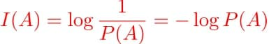
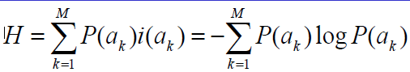

__Factor de compresión__= cociente entre el número de bits necesarios para representar los datos antes de la compresión y el número de bits necesarios para representar los datos después de la compresión.

# Bases de la Compresión Multimedia

- Una fuente X es una “caja” que produce símbolos
- Cada valor de X es la realización de una variable aleatoria xi que toma valores de un conjunto M de posibilidades (símbolos)

```
A = {a1, a2,...,am}
```

- A recibe el nombre de alfabeto, y sus elementos son símbolos o letras

__La Teoría de la Información__ es una rama de las matemáticas relacionada con la cuantificación de la información.

-`` auto-información`` asociada a A definida mediante:



a mayor probabilidad de un suceso menor auto-información asociada.

__Propiedad de la auto-información__: La auto-información de dos sucesos A y B que son independientes es la suma las auto-informaciones de A y B.

__Hentropia__:



- acotado por: ``0 <= H(X) <= log M`` donde  m es el numero de valores de X(fuente)

- Si todos los sucesos son igualmente probables: ``H(X) = log M``
- Si X es determinista: H(X)=0

Shannon probó que si una fuente produce un conjunto de símbolos (letras) que tienen unas determinadas probabilidades:
- __La entropía es el número medio de símbolos binarios necesarios para codificar la salida de la fuente.__

 Además probó también que:
- __Lo mejor que un esquema de compresión sin pérdida puede hacer es codificar la salida de una fuente (experimento) con un número medio de bits igual a la entropía de la fuente.__